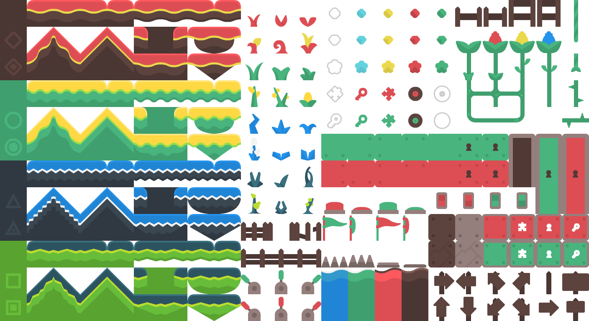

PNG_Utils is a PNG decoder and collection of useful functions to read, parse, and edit PNG files in pure JS without the need for Node.
====

Example
----
Extracting one 64x64 tile from the below tilesheet:


```js
    function foo(evt) {
        const myPNG = await new png(evt);
        const decompressedData = await myPNG.decompressIDATData();
        const unfilteredData = myPNG.reverseFiltering(decompressedData);
        for (let i = 0; i < 64;i++){
        const subImage = myPNG.subImage(unfilteredData, { x: 64, y: 64 }, { xMargin: 0, yMargin: 0 });
        }
    }
```

Usage
----
```js
    //With event
    function foo(evt) {
        const myPNG = await new png(evt);
    }
    //Without event
    function foo(file) {
        const myPNG = await new png(file);
    }

```
Decompression, unfiltering, and extracting sub-images.
----
```js
    function foo(evt) {
        const myPNG = await new png(evt);
        const decompressedData = await myPNG.decompressIDATData();
        const unfilteredData = myPNG.reverseFiltering(decompressedData);
        const subImage = myPNG.subImage(unfilteredData, { x: 64, y: 64 }, { xMargin: 0, yMargin: 0 });
    }
```